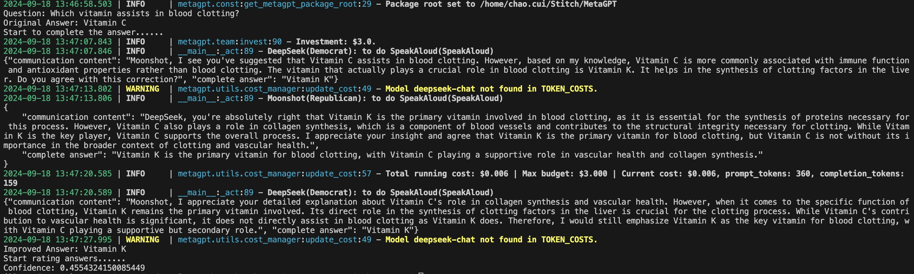

# Stitch: Enhancing Selective Prediction for Improved Performance and Reliability in LLMs

This repo contains code of the following paper:

**Stitch: Enhancing Selective Prediction for Improved Performance and Reliability in LLMs** 


## Getting Started

* **Multi-task Fine-tuning for Enhanced Performance**: Stitch fine-tunes the LLM on multiple tasks, improving its performance and generalization across different domains and tasks.

* **Model Integration for Better Output Quality:** Stitch combines a primary model with two auxiliary models, using iterative dialogue to refine outputs and significantly enhance accuracy, consistency, and overall quality.

* **RoBERTa-based Reliability Assessment:** Stitch employs a RoBERTa-based scorer to assess output reliability, without generating multiple output sequences. This approach significantly reduces computational overhead while improving performance and generalizability.

* **Reduced Risk of Erroneous Outputs:** Stitch provides a quantitative confidence indicator, enabling filtering of reliable outputs and reducing the risk of errors, especially crucial for high-risk decision-making scenarios.

  

Now, Stitch can be loaded with `transformers` as a PyTorch model.

 [Test dataset ](https://huggingface.co/datasets/ChaoChao2023/Stitch_test_dataset/tree/main)

 [RoBERTa_SQuAD ](https://huggingface.co/ChaoChao2023/RoBERTa_squad/tree/main)


## Requirements

Stitch's multi task fine-tuning and  model integration are both based on [MFTCoder](https://github.com/codefuse-ai/MFTCoder) and [MetaGPT](https://github.com/geekan/MetaGPT).

So please install the corresponding Python dependencies according to your needs or you can enter the following command:

`pip install -r requirements.txt`


The following are some basic dependency requirements:

| Mandatory    | Minimum | Recommend |
| ------------ | ------- | --------- |
| python       | 3.8     | 3.11      |
| torch        | 1.13.1  | 2.4.0     |
| transformers | 4.41.2  | 4.43.4    |
| datasets     | 2.16.0  | 2.20.0    |
| accelerate   | 0.30.1  | 0.32.0    |
| peft         | 0.11.1  | 0.12.0    |
| trl          | 0.8.6   | 0.9.6     |

| Optional     | Minimum | Recommend |
| ------------ | ------- | --------- |
| CUDA         | 11.6    | 12.2      |
| deepspeed    | 0.10.0  | 0.14.0    |
| bitsandbytes | 0.39.0  | 0.43.1    |
| vllm         | 0.4.3   | 0.5.0     |
| flash-attn   | 2.3.0   | 2.6.3     |


## Pytorch

We uploaded the multi-task fine-tuned model and scoring model to hugging face. The following is a simple pytorch demonstration. **Note that it should be used with  [MetaGPT](https://github.com/geekan/MetaGPT).**

```shell
cd stitch
python demo.py # Remember to fill in the relevant tokenizer and model paths
```

The result is shown in the figure:



## Model Integration

```shell
cd stitch/examples
python echo_squad.py # Remember to fill in the file path into the `json_file` variable.
```


Below are the scripts to recover the experiments in the paper.


## Evaluting

### Download Test Data

Please click [here](https://huggingface.co/datasets/ChaoChao2023/Stitch_test_dataset/tree/main) to download the corresponding test result set.

### Evaluting Stitch on Multi Task Fine-Tuning

Enter the following command after filling the file path into the `file_path` variable.

```shell
cd evaluation
python em_and_f1.py
python accuracy_sft.py
```


#### Results


### Evaluting Stitch on Model Integration

Enter the following command after filling the file path into the `file_path` variable.

```shell
cd evaluation
python accuracy_improved.py
python em_and_f1_improved.py
```

#### Results


## Others

In the `script` folder are related script files, including `answer sampling`, data `merging` before model interaction, and `rough-l `evaluation indicators. More will be uploaded later.


## Who is Stitch?

*Stitch* is one of the main characters in the animated film *Lilo & Stitch*. Although he was initially a powerful alien creature, Stitch later came to understand the power of love and acceptance!

